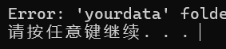
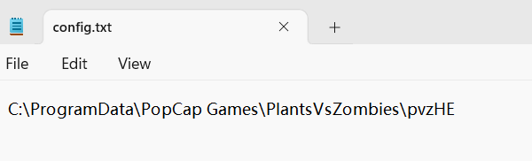
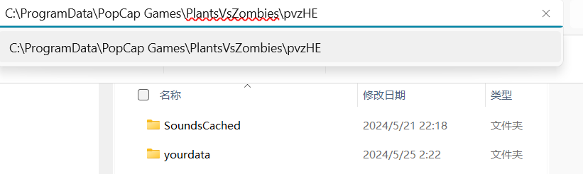
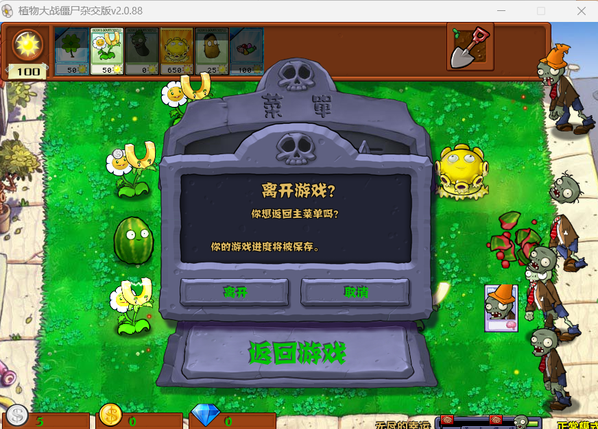
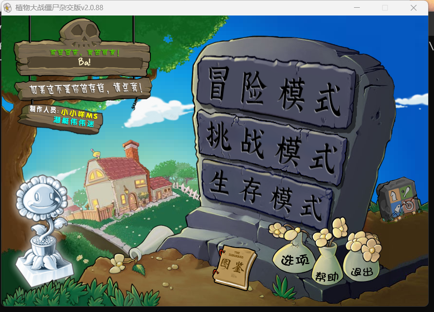
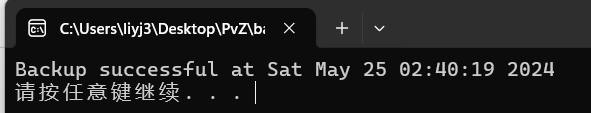
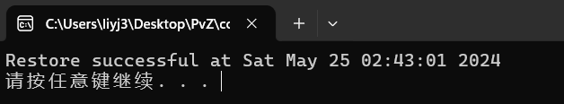

# 使用说明

本程序用于pvz(杂交版, 作者:潜艇伟伟迷)的存档备份和恢复, 可以用来部分解决闪退问题.

已经开源到

## 1. 路径配置

双击运行backup.exe. 如果你运行backup.exe时没有错误, 即弹窗中的开头不是Error(如下图), 你可以跳过这一步.

否则, 你需要根据你的安装路径修改config.txt中的路径配置.

打开config.txt, 将其中的文件夹路径设置成你的Pvz文件路径,如图. 一般无需更改.

在该文件夹路径下,你应当(至少)能看到SoundsCached和yourdata两个文件夹:

如果能看到 说明配置正确.

## 2.存档备份

在你想要***备份当前场面时***,需要进行以下步骤:

1. 按键盘左上角esc->点击"主菜单"->点击"离开":

   
2. 此时你会回到如下图的主菜单中:
3. 双击运行文件夹中的backup.exe,如果显示以下弹窗则说明备份成功(后面的时间是备份时间,你的显示可能与下面的截图不一样):

   

   此时可以按任意键退出弹窗, 你可以回到你的游戏中继续进行游戏.

## 3.存档恢复

1. 在游戏崩溃后, 双击运行cover.exe, 出现以下弹窗说明运行成功(后面的时间是备份恢复时间, 你的显示可能与下面的截图不一样):

   

   此时已使用之前保存的存档覆盖当前归零的存档. 此时可以按任意键退出弹窗, 你可以回到你的游戏中继续进行游戏.
